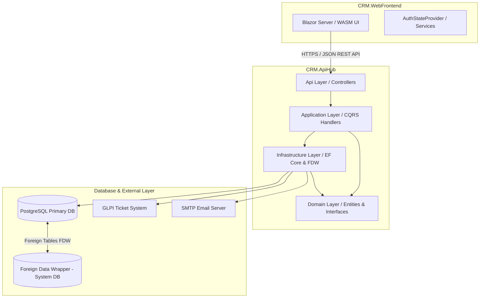

# Arquitectura del Sistema — CRM Call Center

## 1. Visión General de Arquitectura

La solución está construida bajo una arquitectura de micro-servicios lógicos/monolito modular con separación limpia de responsabilidades (Arquitectura Hexagonal / Puertos y Adaptadores) en el Backend `CRM.ApiHub` y Blazor en el Frontend `CRM.WebFrontend`.

---

## 2. Capas de `CRM.ApiHub` (Arquitectura Hexagonal)

1. **`CRM.ApiHub.Api` (Adaptadores de Entrada HTTP)**:
   - Contiene los controladores REST API, Middlewares de autenticación, filtros de excepción global y SignalR Hubs.
2. **`CRM.ApiHub.Application` (Casos de Uso / CQRS)**:
   - Contiene la lógica de aplicación, comandos, consultas, DTOs y validaciones.
3. **`CRM.ApiHub.Domain` (Núcleo de Negocio)**:
   - Entidades del dominio (Ventas, Clientes, Comisiones, Auditoría), Objetos de Valor e interfaces de repositorios (Puertos).
4. **`CRM.ApiHub.Infrastructure` (Adaptadores de Salida)**:
   - Implementación de repositorios EF Core, mapeo a PostgreSQL, enlaces FDW, cliente HTTP para GLPI y servicios SMTP.

---

## 3. Patrones de Diseño Aplicados
- **Clean Architecture / Hexagonal Architecture**: Desacoplamiento total de la lógica de negocio respecto a la infraestructura o frameworks web.
- **Repository & Unit of Work Pattern**: Abstracción del acceso a datos.
- **JWT Bearer Token Authentication**: Autenticación apátrida (stateless) para comunicación segura entre Blazor y la API REST.
