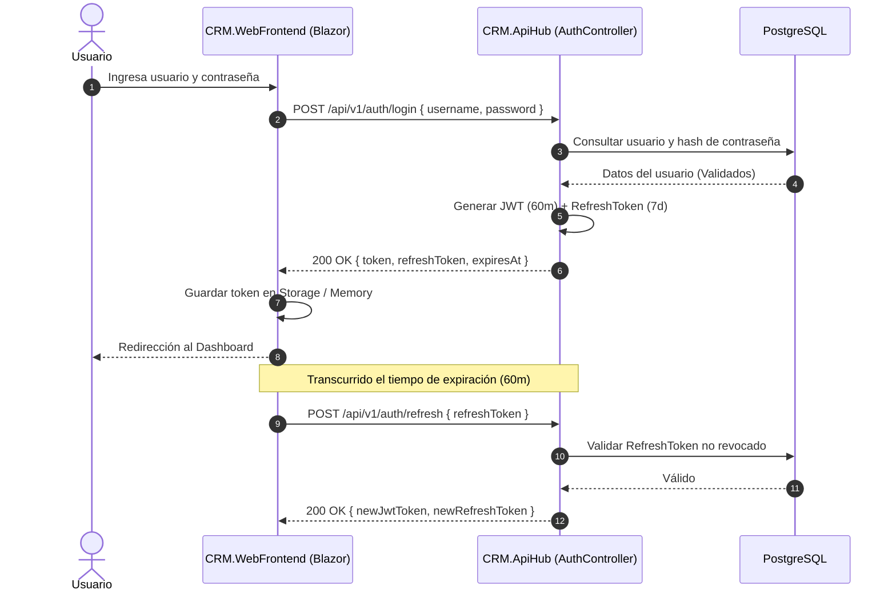

# Flujo de Autenticación y Refresco de Sesión

## Objetivo
Detallar el intercambio de credenciales y la renovación transparente de tokens JWT entre el frontend Blazor y `CRM.ApiHub`.

---

## Diagrama del Flujo

