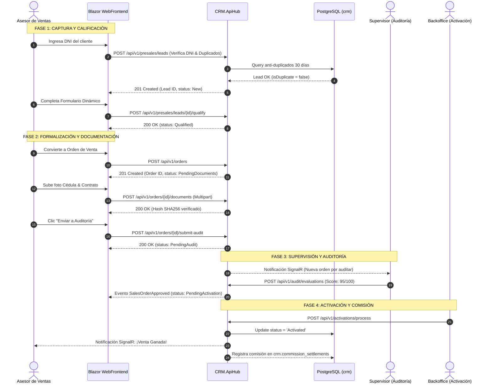
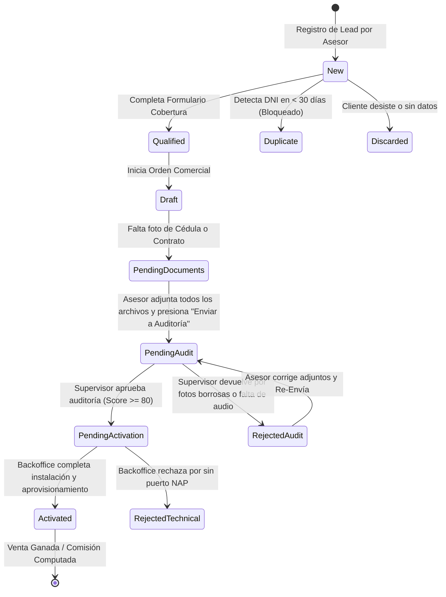

# Flujo E2E: Procesamiento Comercial desde PreVenta hasta Activación

Este documento especifica la secuencia completa del proceso comercial desde la perspectiva del **Asesor de Ventas**, describiendo las transiciones de estado, invocaciones API REST, eventos de dominio y manejo de excepciones en la plataforma CRM Call Center.

---

## 🗺️ Diagrama de Secuencia E2E (Asesor -> Supervisor -> Backoffice)

---

## 🔄 Máquina de Estados de la Orden de Venta

---

## 📋 Detalle Procedimental de las Fases del Asesor

### Fase 1: Recepción y Verificación de Duplicidad (Asesor)
1. El asesor recibe la llamada o contacto del cliente.
2. Presiona `Ctrl + Alt + N` en `AsesorDashboard.razor` e ingresa la cédula.
3. **Validación API**: `POST /api/v1/presales/leads`.
4. Si la respuesta es HTTP 409 (Duplicado), la interfaz bloquea el flujo comercial e indica el ID de la orden original activa.

### Fase 2: Calificación y Formulario Dinámico (Asesor)
1. Si el Lead es nuevo (`New`), el asesor presiona **Calificar Elegibilidad**.
2. Completa las preguntas del formulario dinámico retornado por `GET /api/v1/forms/{id}`.
3. El sistema valida la factibilidad de cobertura y cambia el estado a `Qualified`.

### Fase 3: Formalización y Subida Multipart de Adjuntos (Asesor)
1. El asesor selecciona el plan contratado (`PLAN-FIBRA-300M`, `PLAN-FIBRA-500M`, etc.).
2. Sube la foto del documento de identidad usando la interfaz de `AsesorOrderDetail.razor`.
3. Invoca la API `POST /api/v1/orders/{id}/documents`.
4. Al verificarse los requisitos mínimos, presiona **Enviar a Auditoría**. La orden pasa a `PendingAudit`.

### Fase 4: Manejo de Devoluciones (Asesor)
1. Si el Supervisor rechaza la venta (`Score < 80` o foto ilegible), el asesor recibe una alerta push en tiempo real vía **SignalR**.
2. La orden cambia al estado `RejectedAudit`.
3. El asesor revisa las observaciones del Supervisor en `AsesorOrderDetail.razor`, reemplaza el archivo defectuoso y presiona **Re-Enviar a Auditoría**.

### Fase 5: Confirmación de Activación y Comisión (Asesor)
1. Una vez que Backoffice completa la instalación física, la orden pasa a `Activated`.
2. El sistema envía una notificación al Asesor e incrementa su contador de ventas mensual en el módulo de comisiones (`/commissions/summary`).
