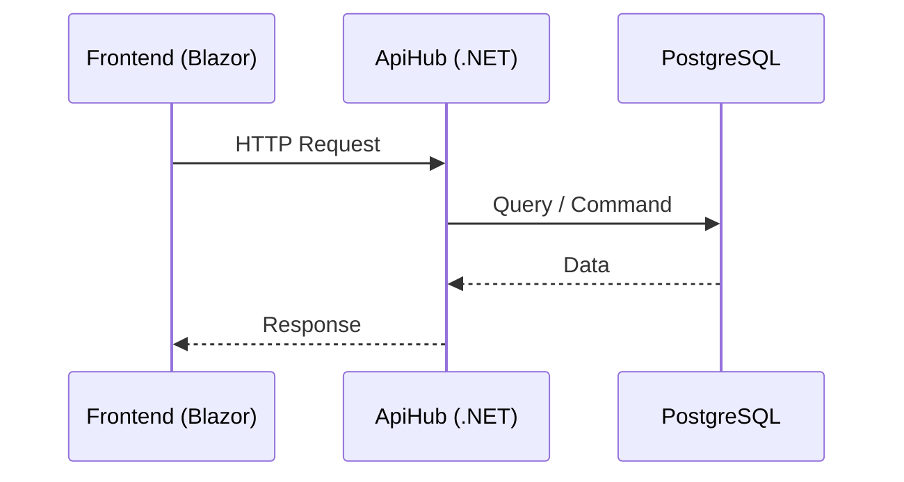

# [Nombre del Flujo]

## Objetivo
[Qué proceso cumple este flujo]

## Actores
- Usuario (Rol)
- Frontend (`CRM.WebFrontend`)
- Backend API (`CRM.ApiHub`)
- Base de Datos / Servicios Externos

## Precondiciones
- Precondición 1

## Flujo Principal
1. El usuario realiza X en la interfaz.
2. El Frontend envía petición HTTP a `ENDPOINT`.
3. El Backend valida, procesa y persiste.
4. El Backend responde con 200/201.
5. El Frontend actualiza el estado visual.

## Flujos Alternativos / Errores

| Código | Causa | Acción en Frontend |
|---|---|---|
| 400 | Datos inválidos | Mostrar error de validación |
| 401 | Sesión expirada | Redirigir a Login |

## Diagrama de Secuencia

