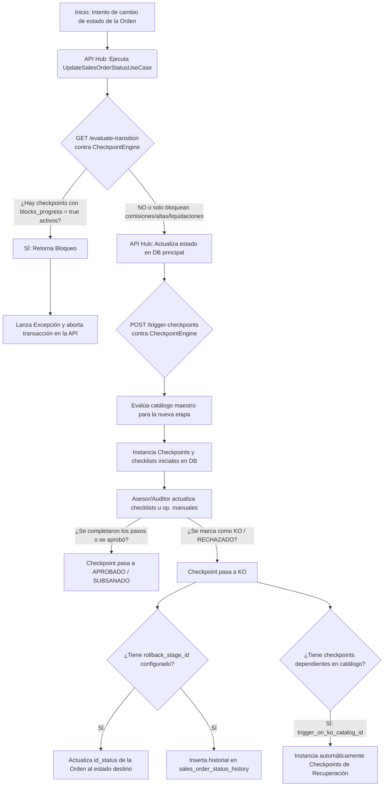

# Arquitectura y Diseño: Motor de Checkpoints (Nyx.CheckpointEngine)

Este documento detalla la arquitectura técnica, el diagrama de flujo y las estructuras de datos (tablas y triggers) implementadas para el nuevo motor de checkpoints.

---

## 1. Diagrama de Flujo del Motor de Checkpoints

El siguiente diagrama ilustra el flujo de evaluación de transiciones, distinguiendo entre bloqueos de avance de etapa y bloqueos de procesos paralelos (comisiones, altas, etc.):



---

## 2. Tipos de Bloqueo: Avance de Etapa vs. Procesos Paralelos

El motor de checkpoints distingue entre dos filosofías de bloqueo para otorgar flexibilidad al negocio:

1.  **Bloqueo Estricto de Avance (`blocks_progress = true`)**:
    *   **Comportamiento**: Impide que la orden de venta avance en el pipeline general (de etapa a etapa, ej: de *Revisión supervisor* a *En Backoffice*).
    *   **Efecto**: Bloquea el flujo del usuario en la API. Si se intenta realizar el cambio de estado sin haber aprobado este checkpoint, el backend aborta la transacción y arroja un error visible en la UI.
2.  **Bloqueo de Procesos Paralelos (`blocks_commission`, `blocks_activation`, `blocks_liquidation`)**:
    *   **Comportamiento**: **NO** impide que la orden avance de etapa en el lifecycle. El asesor o backoffice pueden seguir moviendo la venta en el embudo.
    *   **Efecto**: Retiene únicamente el sub-proceso correspondiente aguas abajo (ej: el motor de comisiones ignorará este ítem al hacer el corte mensual, o el sistema de altas no enviará la señal de aprovisionamiento). Esto permite que el asesor pueda subsanar errores en los documentos más tarde sin frenar la tramitación del pedido con el proveedor.

---

---

## 2. Modelado de Base de Datos (PostgreSQL)

Hemos implementado la estructura completa del sistema de checkpoints en la base de datos bajo el esquema `sales_service`.

### Tablas Creadas
1.  **`sales_service.checkpoint_catalog`**: Almacena las reglas maestras de los checkpoints y sus comportamientos.
    ```sql
    CREATE TABLE sales_service.checkpoint_catalog (
        id_checkpoint_catalog SERIAL PRIMARY KEY,
        name VARCHAR(150) NOT NULL,
        applies_to VARCHAR(100) NOT NULL,
        trigger_stage_id INTEGER NOT NULL REFERENCES sales_service.order_status(id_status),
        origin VARCHAR(50) NOT NULL DEFAULT 'INTERNO',
        scope VARCHAR(50) NOT NULL DEFAULT 'Venta',
        blocks_progress BOOLEAN NOT NULL DEFAULT FALSE,
        blocks_commission BOOLEAN NOT NULL DEFAULT FALSE,
        blocks_activation BOOLEAN NOT NULL DEFAULT FALSE,
        blocks_liquidation BOOLEAN NOT NULL DEFAULT FALSE,
        rollback_stage_id INTEGER REFERENCES sales_service.order_status(id_status),
        trigger_on_ko_catalog_id INTEGER REFERENCES sales_service.checkpoint_catalog(id_checkpoint_catalog),
        owner_department VARCHAR(100) NOT NULL,
        required_steps_count INTEGER NOT NULL DEFAULT 0,
        is_active BOOLEAN NOT NULL DEFAULT TRUE,
        created_at TIMESTAMP WITH TIME ZONE DEFAULT CURRENT_TIMESTAMP
    );
    ```
2.  **`sales_service.checkpoint_step`**: Define el checklist estático asociado a cada plantilla de checkpoint.
    ```sql
    CREATE TABLE sales_service.checkpoint_step (
        id_checkpoint_step SERIAL PRIMARY KEY,
        id_checkpoint_catalog INTEGER NOT NULL REFERENCES sales_service.checkpoint_catalog ON DELETE CASCADE,
        step_index INTEGER NOT NULL,
        description VARCHAR(255) NOT NULL,
        UNIQUE (id_checkpoint_catalog, step_index)
    );
    ```
3.  **`sales_service.order_checkpoint`**: Instancias de checkpoints asociadas a cada orden de venta en tiempo real.
    ```sql
    CREATE TABLE sales_service.order_checkpoint (
        id_order_checkpoint SERIAL PRIMARY KEY,
        id_order INTEGER NOT NULL REFERENCES sales_service.sales_order ON DELETE CASCADE,
        id_checkpoint_catalog INTEGER NOT NULL REFERENCES sales_service.checkpoint_catalog,
        status VARCHAR(50) NOT NULL DEFAULT 'PENDIENTE', -- PENDIENTE, EN_PROCESO, APROBADO, RECHAZADO, KO
        comments TEXT,
        checked_by INTEGER REFERENCES user_service.users,
        checked_at TIMESTAMP WITH TIME ZONE,
        steps_completed INTEGER NOT NULL DEFAULT 0,
        created_at TIMESTAMP WITH TIME ZONE DEFAULT CURRENT_TIMESTAMP,
        updated_at TIMESTAMP WITH TIME ZONE DEFAULT CURRENT_TIMESTAMP
    );
    ```
4.  **`sales_service.order_checkpoint_step_status`**: Estado interactivo en vivo de cada sub-paso de checklist.
    ```sql
    CREATE TABLE sales_service.order_checkpoint_step_status (
        id_order_checkpoint INTEGER NOT NULL REFERENCES sales_service.order_checkpoint ON DELETE CASCADE,
        step_index INTEGER NOT NULL,
        is_completed BOOLEAN NOT NULL DEFAULT FALSE,
        updated_by INTEGER REFERENCES user_service.users,
        updated_at TIMESTAMP WITH TIME ZONE DEFAULT CURRENT_TIMESTAMP,
        PRIMARY KEY (id_order_checkpoint, step_index)
    );
    ```

---

## 3. Triggers e Historial de Auditoría

El sistema aprovecha los triggers automáticos preexistentes en la base de datos para mantener un registro histórico inmutable:

*   **Trigger `fn_log_order_status_change`**:
    Asociado a la tabla `sales_service.sales_order`. Cuando el motor autónomo (`CheckpointEngine`) ejecuta un rollback automático modificando el `id_status` de la orden, este trigger captura el cambio e inserta la justificación y los comentarios en la tabla particionada `sales_service.sales_order_status_history`.

---

## 4. Cambios Realizados en el API Hub

Para integrarse con el motor autónomo de checkpoints, se modificó el comportamiento del pipeline principal del CRM:

1.  **Registro del Cliente de HttpClient**:
    En `CRM.ApiHub/Infrastructure/DependencyInjection.cs`, se inyecta el cliente HTTP del motor:
    ```csharp
    services.AddHttpClient("CheckpointEngine", client => {
        client.BaseAddress = new Uri(config["CheckpointEngineSettings:BaseUrl"]);
    });
    ```
2.  **Modificación del Flujo de Estados (`UpdateSalesOrderStatusUseCase`)**:
    *   **Pre-transición**: Realiza un POST a `api/engine/evaluate-transition`. Si retorna bloqueos, aborta inmediatamente arrojando una excepción.
    *   **Post-transición**: Realiza un POST a `api/engine/trigger-checkpoints` para que el motor inicialice de forma autónoma los checkpoints del nuevo estado.
